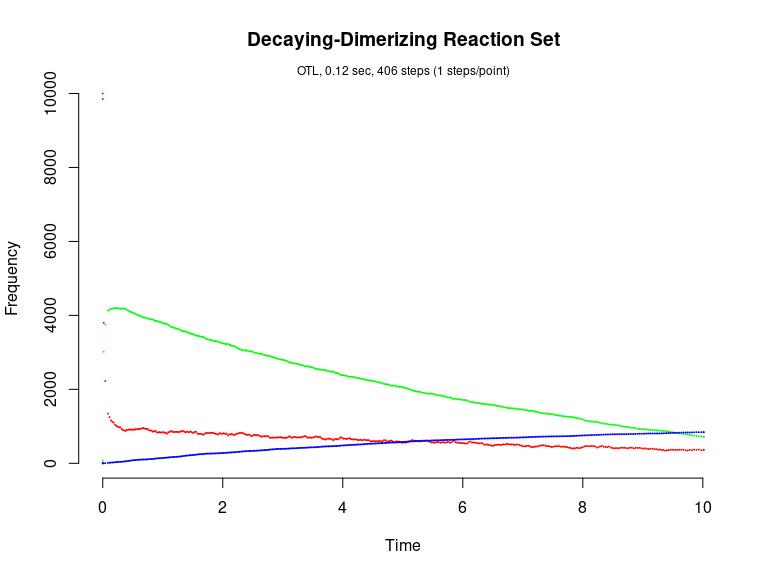

Decaying-Dimerization Reaction Set
================

<!-- github markdown built using 
rmarkdown::render("vignettes/decaying_dimer.Rmd", output_format = "github_document")
-->

The Decaying-Dimerization Reaction Set (Gillespie, 2001) consists of
three species and four reaction channels.

``` 
      S1 --c1--> 0
 S1 + S1 --c2--> S2
      S2 --c3--> S1 + S1
      S2 --c4--> S3
```

Load package

``` r
library(GillespieSSA)
```

Define parameters

``` r
parms <- c(c1=1.0, c2=0.002, c3=0.5, c4=0.04)
```

Define initial state vector

``` r
x0 <- c(s1=10000, s2=0, s3=0)
```

Define state-change matrix

``` r
nu <- matrix(c(-1, -2, +2,  0,
                0, +1, -1, -1,
                0,  0,  0, +1),
                nrow=3,byrow=TRUE)
```

Define propensity functions

``` r
a  <- c("c1*s1", "c2*s1*s1", "c3*s2", "c4*s2")
```

Final time

``` r
tf <- 10
```

Simulation name

``` r
simName <- "Decaying-Dimerizing Reaction Set"
```

Run simulations with the Direct method

``` r
set.seed(1)
out <- ssa(
  x0 = x0,
  a = a,
  nu = nu,
  parms = parms,
  tf = tf,
  method = "D",
  simName = simName,
  verbose = FALSE,
  consoleInterval = 1
) 
ssa.plot(out, show.title = TRUE, show.legend = FALSE)
```

<!-- -->

Run simulations with the Explict tau-leap method

``` r
set.seed(1)
out <- ssa(
  x0 = x0,
  a = a,
  nu = nu,
  parms = parms,
  tf = tf,
  method = "ETL",
  tau = 0.003,
  simName = simName,
  verbose = FALSE,
  consoleInterval = 1
) 
ssa.plot(out, show.title = TRUE, show.legend = FALSE)
```

<!-- -->

Run simulations with the Binomial tau-leap method

``` r
set.seed(1)
out <- ssa(
  x0 = x0,
  a = a,
  nu = nu,
  parms = parms,
  tf = tf,
  method = "BTL",
  simName = simName,
  verbose = FALSE,
  consoleInterval = 1
) 
ssa.plot(out, show.title = TRUE, show.legend = FALSE)
```

<!-- -->

Run simulations with the Optimized tau-leap method

``` r
set.seed(1)
out <- ssa(
  x0 = x0,
  a = a,
  nu = nu,
  parms = parms,
  tf = tf,
  method = "OTL",
  simName = simName,
  verbose = FALSE,
  consoleInterval = 1
) 
ssa.plot(out, show.title = TRUE, show.legend = FALSE)
```

<!-- -->
