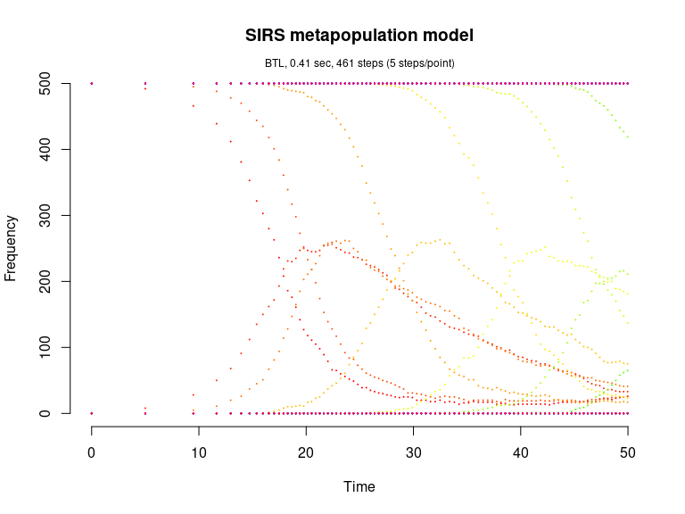

SIRS metapopulation model (Pineda-Krch, 2008)
================

<!-- github markdown built using 
rmarkdown::render("vignettes/epi_chain.Rmd", output_format = "github_document")
-->

The SIRS epidemiological metapopulation model is defined in Pineda-Krch
(2008).

Load package

``` r
library(GillespieSSA)
```

Define parameters

``` r
patchPopSize <- 500                    # Patch size
U <- 20                                # Number of patches
simName <- "SIRS metapopulation model" # Simulation name
tf <- 50                               # Final time

parms <- c(
  beta = 0.001,                        # Transmission rate
  gamma = 0.1,                         # Recovery rate
  rho = 0.005,                         # Loss of immunity rate
  epsilon = 0.01,                      # Proportion inter-patch transmissions
  N = patchPopSize                     # Patch population size (constant)
) 
```

Create the named initial state vector for the U-patch system. The
structure of `x0` is as follows (assuming a patchsize of 500
individuals),

    x0 <- c(
      S1 = 499, I1 = 1, 
      S2 = 500, I2 = 0,
      S3 = 500, I3 = 0, 
      ... 
      S20 = 500, I20 = 0
    )

``` r
x0 <- c(patchPopSize - 1, 1, rep(c(patchPopSize, 0), U - 1))
names(x0) <- unlist(lapply(seq_len(U), function(i) paste0(c("S", "I"), i)))
```

Define the state change matrix for a single patch

``` r
nu <- matrix(c(-1, -1,  0, +1,  # S
               +1, +1, -1,  0), # I
             nrow=2,byrow=TRUE)
```

Define propensity functions

``` r
a <- unlist(lapply(
  seq_len(U),
  function(patch) {
    i <- patch
    j <- if (patch == 1) U else patch - 1
    
    c(
      paste0("(1-epsilon)*beta*S", i, "*I", i), # Intra-patch infection
      paste0("epsilon*beta*S", i, "*I", j),     # Inter-patch infection
      paste0("gamma*I", i),                     # Recovery from infection
      paste0("rho*(N-S", i, "-I", i, ")")       # Loss of immunity
    )
  }
))
```

Run simulations with the Direct method

``` r
set.seed(1)
out <- ssa(
  x0 = x0,
  a = a,
  nu = nu,
  parms = parms,
  tf = tf,
  method = "D",
  simName = simName,
  verbose = FALSE,
  consoleInterval = 1
) 
ssa.plot(out, by = 5, show.title = TRUE, show.legend = FALSE)
```

<!-- -->

Run simulations with the Explict tau-leap method

``` r
set.seed(1)
out <- ssa(
  x0 = x0,
  a = a,
  nu = nu,
  parms = parms,
  tf = tf,
  method = "ETL",
  simName = simName,
  verbose = FALSE,
  consoleInterval = 1
) 
ssa.plot(out, by = 5, show.title = TRUE, show.legend = FALSE)
```

<!-- -->

Run simulations with the Binomial tau-leap method

``` r
set.seed(1)
out <- ssa(
  x0 = x0,
  a = a,
  nu = nu,
  parms = parms,
  tf = tf,
  method = "BTL",
  simName = simName,
  verbose = FALSE,
  consoleInterval = 1
) 
ssa.plot(out, by = 5, show.title = TRUE, show.legend = FALSE)
```

<!-- -->

Run simulations with the Optimized tau-leap method

``` r
set.seed(1)
out <- ssa(
  x0 = x0,
  a = a,
  nu = nu,
  parms = parms,
  tf = tf,
  method = "OTL",
  hor = rep(2,length(x0)),
  simName = simName,
  verbose = FALSE,
  consoleInterval = 1
) 
ssa.plot(out, by = 5, show.title = TRUE, show.legend = FALSE)
```

<!-- -->
