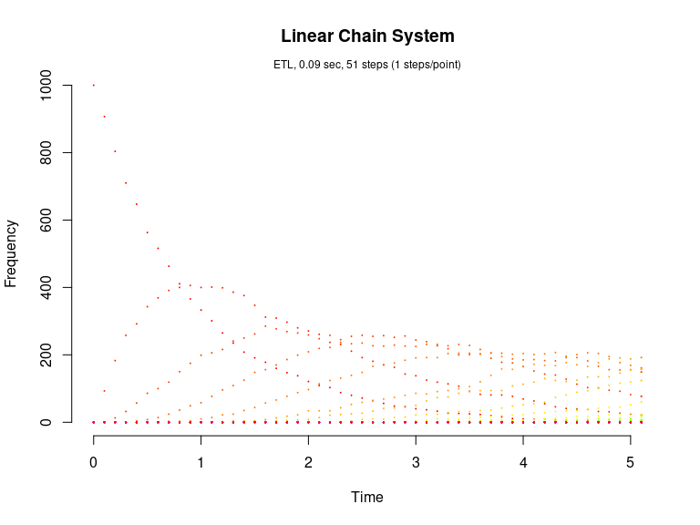
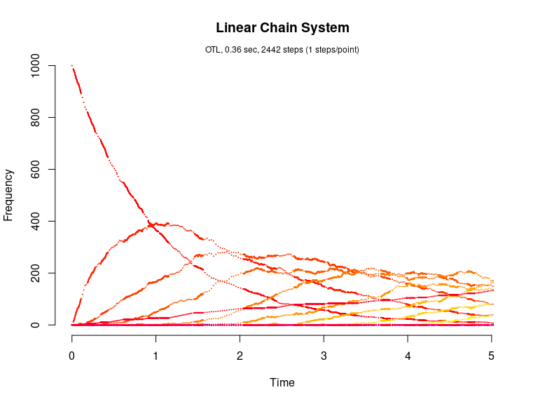

Linear Chain System (Cao et al., 2004)
================

<!-- github markdown built using 
rmarkdown::render("vignettes/linear_chain.Rmd", output_format = "github_document")
-->

The Linear Chain System consists of M chain reactions with M+1 species
as follows:

``` 
  S_1 --c1--> S_2
  S_2 --c2--> S_3
       ...
  S_M --cM--> S_(M+1)
```

Load package

``` r
library(GillespieSSA)
```

Define parameters

``` r
parms <- c(c = 1)                # Rate parameter
M <- 50                          # Number of chain reactions
simName <- "Linear Chain System" # Simulation name
tf <- 5                          # Final time
```

Define initial state vector

``` r
x0 <- c(1000, rep(0, M)) 
names(x0) <- paste0("x", seq_len(M+1))
```

Define state-change matrix

``` r
nu <- matrix(rep(0, M * (M+1)), ncol = M)
nu[cbind(seq_len(M), seq_len(M))] <- -1
nu[cbind(seq_len(M)+1, seq_len(M))] <- 1
```

Define propensity functions

``` r
a <- paste0("c*x", seq_len(M))
```

Run simulations with the Direct method

``` r
set.seed(1)
out <- ssa(
  x0 = x0,
  a = a,
  nu = nu,
  parms = parms,
  tf = tf,
  method = "D",
  simName = simName,
  verbose = FALSE,
  consoleInterval = 1
) 
ssa.plot(out, show.title = TRUE, show.legend = FALSE)
```

<!-- -->

Run simulations with the Explict tau-leap method

``` r
set.seed(1)
out <- ssa(
  x0 = x0,
  a = a,
  nu = nu,
  parms = parms,
  tf = tf,
  method = "ETL",
  tau = 0.003,
  simName = simName,
  verbose = FALSE,
  consoleInterval = 1
) 
ssa.plot(out, show.title = TRUE, show.legend = FALSE)
```

<!-- -->

Run simulations with the Binomial tau-leap method

``` r
set.seed(1)
out <- ssa(
  x0 = x0,
  a = a,
  nu = nu,
  parms = parms,
  tf = tf,
  method = "BTL",
  simName = simName,
  verbose = FALSE,
  consoleInterval = 1
) 
ssa.plot(out, show.title = TRUE, show.legend = FALSE)
```

<!-- -->

Run simulations with the Optimized tau-leap method

``` r
set.seed(1)
out <- ssa(
  x0 = x0,
  a = a,
  nu = nu,
  parms = parms,
  tf = tf,
  method = "OTL",
  simName = simName,
  verbose = FALSE,
  consoleInterval = 1
) 
ssa.plot(out, show.title = TRUE, show.legend = FALSE)
```

<!-- -->
