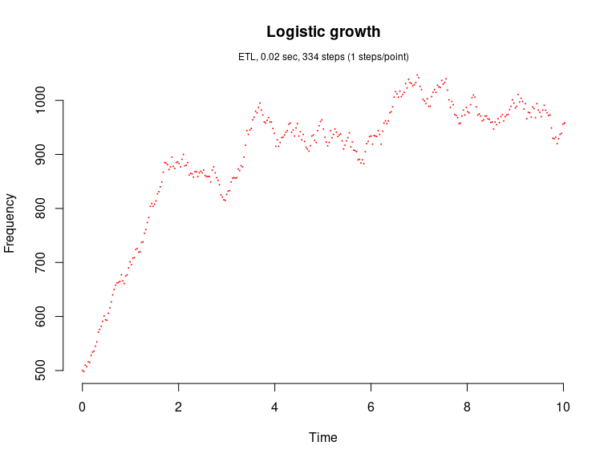
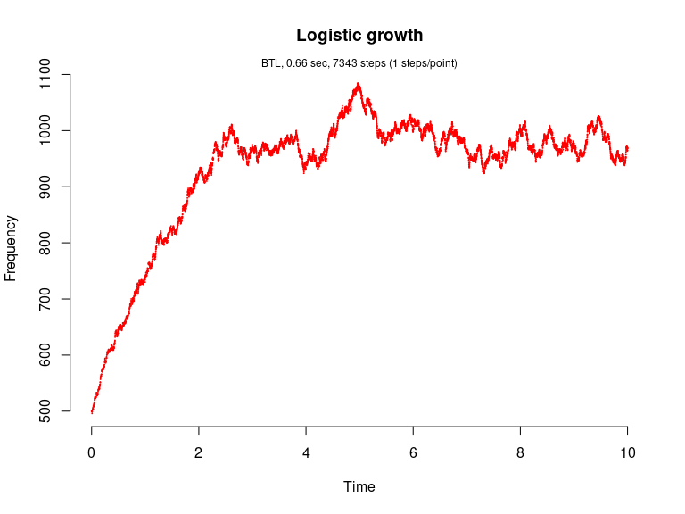

Pearl-Verhulst Logistic growth model (Kot, 2001)
================

<!-- github markdown built using 
rmarkdown::render("vignettes/logistic_growth.Rmd", output_format = "github_document")
-->

The logistic growth model is given by `dN/dt = rN(1-N/K)` where `N` is
the number (density) of indviduals at time `t`, `K` is the carrying
capacity of the population, `r` is the intrinsic growth rate of the
population. We assume `r=b-d` where `b` is the per capita p.c. birth
rate and `d` is the p.c. death rate.

This model consists of two reaction channels,

``` 
 N ---b--->  N + N
 N ---d'---> 0
```

where `d'=d+(b-d)N/K`. The propensity functions are `a_1=bN` and
`a_2=d'N`.

Load package

``` r
library(GillespieSSA)
```

Define parameters

``` r
parms <- c(b = 2, d = 1, K = 1000)      # Parameters
tf <- 10                                # Final time
simName <- "Logistic growth" 
```

Define initial state vector

``` r
x0 <- c(N = 500)
```

Define state-change matrix

``` r
nu <- matrix(c(+1, -1),ncol = 2)
```

Define propensity functions

``` r
a  <- c("b*N", "(d+(b-d)*N/K)*N")
```

Run simulations with the Direct method

``` r
set.seed(1)
out <- ssa(
  x0 = x0,
  a = a,
  nu = nu,
  parms = parms,
  tf = tf,
  method = ssa.d(),
  simName = simName,
  verbose = FALSE,
  consoleInterval = 1
) 
ssa.plot(out, show.title = TRUE, show.legend = FALSE)
```

<!-- -->

Run simulations with the Explict tau-leap method

``` r
set.seed(1)
out <- ssa(
  x0 = x0,
  a = a,
  nu = nu,
  parms = parms,
  tf = tf,
  method = ssa.etl(tau = .03),
  simName = simName,
  verbose = FALSE,
  consoleInterval = 1
) 
ssa.plot(out, show.title = TRUE, show.legend = FALSE)
```

<!-- -->

Run simulations with the Binomial tau-leap method

``` r
set.seed(1)
out <- ssa(
  x0 = x0,
  a = a,
  nu = nu,
  parms = parms,
  tf = tf,
  method = ssa.btl(f = 5),
  simName = simName,
  verbose = FALSE,
  consoleInterval = 1
) 
ssa.plot(out, show.title = TRUE, show.legend = FALSE)
```

<!-- -->

Run simulations with the Optimized tau-leap method

``` r
set.seed(1)
out <- ssa(
  x0 = x0,
  a = a,
  nu = nu,
  parms = parms,
  tf = tf,
  method = ssa.otl(),
  simName = simName,
  verbose = FALSE,
  consoleInterval = 1
) 
ssa.plot(out, show.title = TRUE, show.legend = FALSE)
```

<!-- -->
