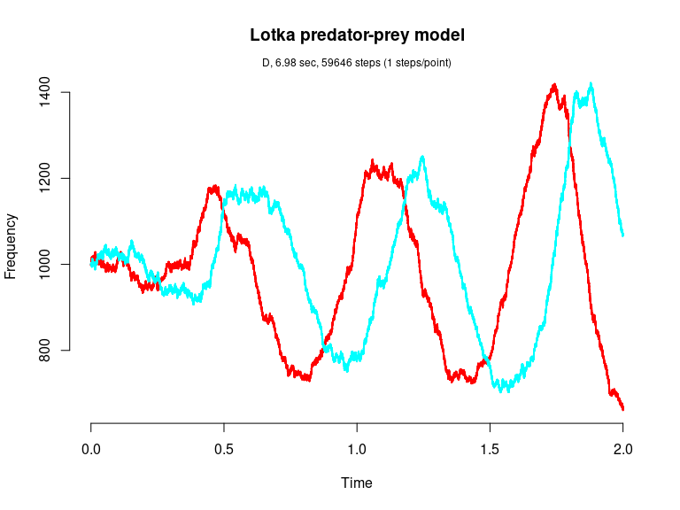
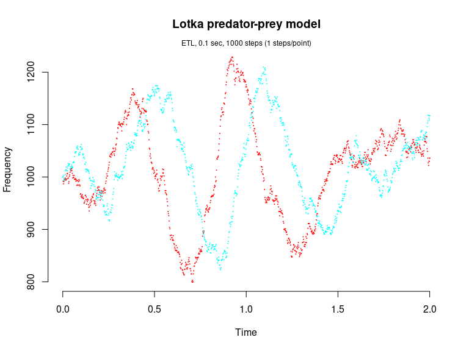

Lotka predator-prey model (Gillespie, 1977; Kot, 2001)
================

<!-- github markdown built using 
rmarkdown::render("vignettes/lotka_predator_prey.Rmd", output_format = "github_document")
-->

This version of the Lotka predator-prey model is given by

    dY1/dt = c1*Y1 - c2*Y1*Y2
    dY2/dt = c2*Y1*Y2 - c3*Y2

consisting of the three reaction channels,

``` 
      Y1 --c1--> Y1 + Y1 
 Y1 + Y2 --c2--> Y2 + Y2 
      Y1 --c3--> 0
```

Load package

``` r
library(GillespieSSA)
```

Define parameters

``` r
parms <- c(c1 = 10, c2 = .01, c3 = 10)
tf <- 2                                        # Final time
simName <- "Lotka predator-prey model"         # Name
```

Define initial state vector

``` r
x0 <- c(Y1=1000, Y2=1000)
```

Define state-change matrix

``` r
nu <- matrix(c(+1, -1, 0, 0, 1, -1), nrow = 2, byrow = TRUE)
```

Define propensity functions

``` r
a  <- c("c1*Y1", "c2*Y1*Y2","c3*Y2")
```

Run simulations with the Direct method

``` r
set.seed(1)
out <- ssa(
  x0 = x0,
  a = a,
  nu = nu,
  parms = parms,
  tf = tf,
  method = "D",
  simName = simName,
  verbose = FALSE,
  consoleInterval = 1
) 
ssa.plot(out, show.title = TRUE, show.legend = FALSE)
```

<!-- -->

Run simulations with the Explict tau-leap method

``` r
set.seed(1)
out <- ssa(
  x0 = x0,
  a = a,
  nu = nu,
  parms = parms,
  tf = tf,
  method = "ETL",
  tau = 0.002,
  simName = simName,
  verbose = FALSE,
  consoleInterval = 1
) 
ssa.plot(out, show.title = TRUE, show.legend = FALSE)
```

<!-- -->

Run simulations with the Binomial tau-leap method

``` r
set.seed(1)
out <- ssa(
  x0 = x0,
  a = a,
  nu = nu,
  parms = parms,
  tf = tf,
  method = "BTL",
  f = 100,
  simName = simName,
  verbose = FALSE,
  consoleInterval = 1
) 
ssa.plot(out, show.title = TRUE, show.legend = FALSE)
```

<!-- -->

Run simulations with the Optimized tau-leap method

``` r
set.seed(1)
out <- ssa(
  x0 = x0,
  a = a,
  nu = nu,
  parms = parms,
  tf = tf,
  method = "OTL",
  epsilon = 0.1,
  simName = simName,
  verbose = FALSE,
  consoleInterval = 1
) 
ssa.plot(out, show.title = TRUE, show.legend = FALSE)
```

<!-- -->
