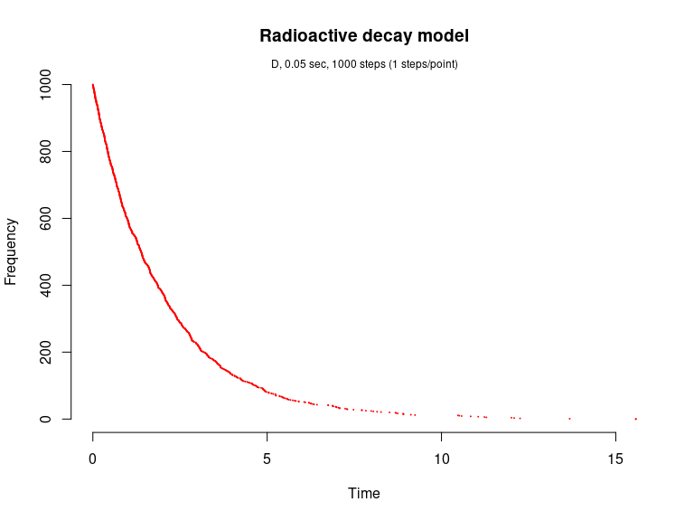
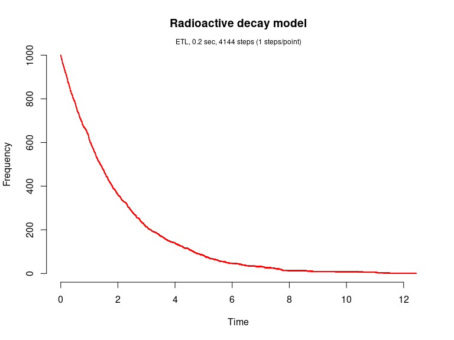
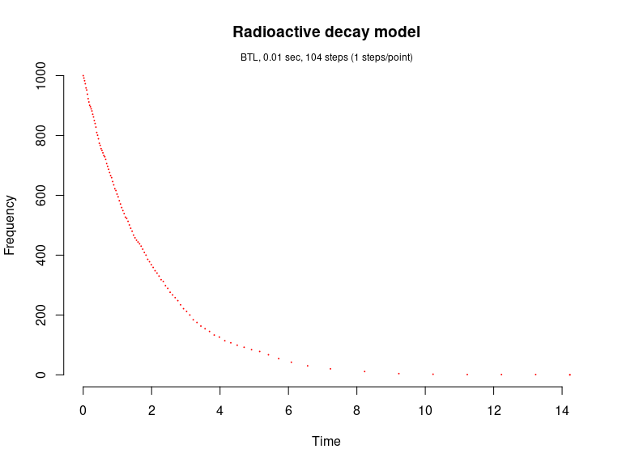
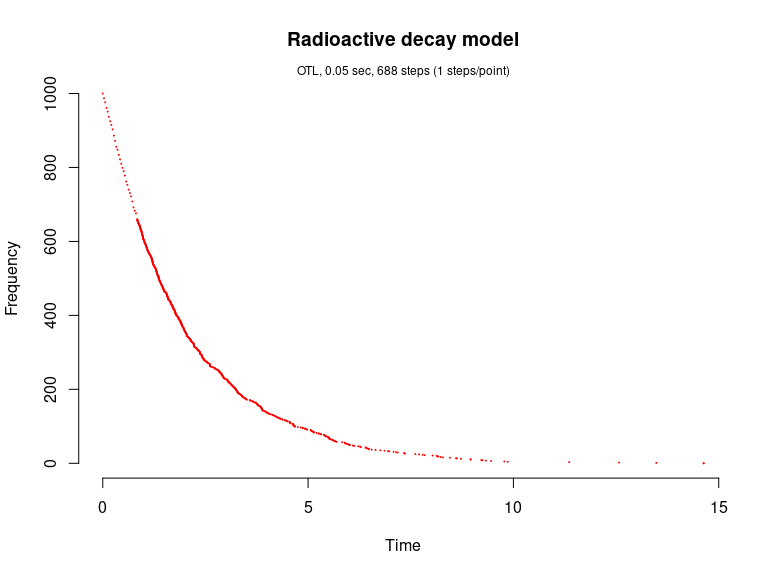

Radioactive decay model (Gillespie, 1977)
================

<!-- github markdown built using 
rmarkdown::render("vignettes/radioactive_decay.Rmd", output_format = "github_document")
-->

This model is also known as the irreversible isomerization reaction set.
It consists of a single species and single reaction channels,

    X --c--> 0

Load package

``` r
library(GillespieSSA)
```

Define parameters

``` r
parms <- c(k = 0.5)
tf <- 20                                       # Final time
simName <- "Radioactive decay model"
```

Define initial state vector

``` r
x0 <- c(N=1000)
```

Define state-change matrix

``` r
nu <- matrix(c(-1),nrow=1,byrow=TRUE)
```

Define propensity functions

``` r
a <- c("k*N")
```

Run simulations with the Direct method

``` r
set.seed(1)
out <- ssa(
  x0 = x0,
  a = a,
  nu = nu,
  parms = parms,
  tf = tf,
  method = ssa.d(),
  simName = simName,
  verbose = FALSE,
  consoleInterval = 1
) 
ssa.plot(out, show.title = TRUE, show.legend = FALSE)
```

<!-- -->

Run simulations with the Explict tau-leap method

``` r
set.seed(1)
out <- ssa(
  x0 = x0,
  a = a,
  nu = nu,
  parms = parms,
  tf = tf,
  method = ssa.etl(tau = .003),
  simName = simName,
  verbose = FALSE,
  consoleInterval = 1
) 
ssa.plot(out, show.title = TRUE, show.legend = FALSE)
```

<!-- -->

Run simulations with the Binomial tau-leap method

``` r
set.seed(1)
out <- ssa(
  x0 = x0,
  a = a,
  nu = nu,
  parms = parms,
  tf = tf,
  method = ssa.btl(),
  simName = simName,
  verbose = FALSE,
  consoleInterval = 1
) 
ssa.plot(out, show.title = TRUE, show.legend = FALSE)
```

<!-- -->

Run simulations with the Optimized tau-leap method

``` r
set.seed(1)
out <- ssa(
  x0 = x0,
  a = a,
  nu = nu,
  parms = parms,
  tf = tf,
  method = ssa.otl(),
  simName = simName,
  verbose = FALSE,
  consoleInterval = 1
) 
ssa.plot(out, show.title = TRUE, show.legend = FALSE)
```

<!-- -->
