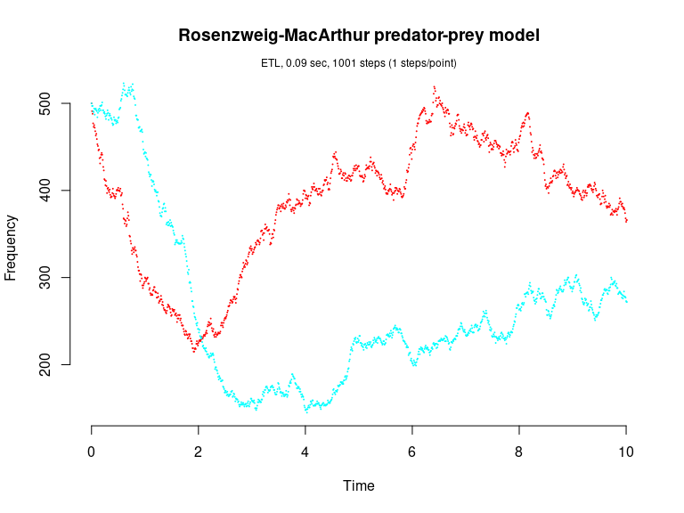
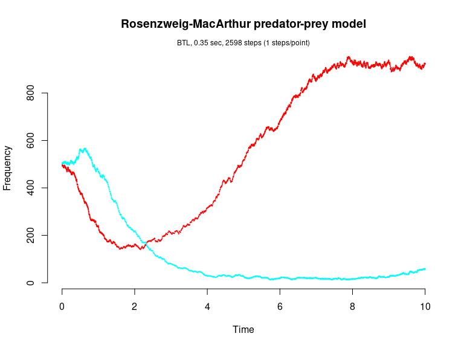

Rosenzweig-MacArthur predator-prey model (Pineda-Krch et al., 2007)
================

<!-- github markdown built using 
rmarkdown::render("vignettes/rm_predator_prey.Rmd", output_format = "github_document")
-->

Rosenzweig-MacArthur predator-prey model (Pineda-Krch et al., 2007,
Pineda-Krch, 2008)

    dN/dt = r(1-N/K - alpha/(1+wN))NP
    dP/dt = c*alpha/(1+wN))NP

This model has five reactions with the following per capita rates,

    prey birth:     b
    prey death:     d+(b-d)N/K
    predation:      alpha/(1+wN)
    predator birth: c*alpha/(1+wN)N
    predator death: g

Propensity functions:

    a1 = b * N
    a2 = (d+(b-d)N/K) * N
    a3 = alpha/(1+wN) * N * P
    a4 = c*alpha/(1+wN) * N * P
    a5 = g * P

Load package

``` r
library(GillespieSSA)
```

Define parameters

``` r
parms <- c(b=2, d=1, K=1000, alpha=0.005, 
           w=0.0025, c=2, g=2)
tf <- 10                                               # Final time
simName <- "Rosenzweig-MacArthur predator-prey model"  # Name
```

Define initial state vector

``` r
x0  <- c(N=500, P=500)
```

Define state-change matrix

``` r
nu  <- matrix(c(+1, -1, -1,  0,  0,
                 0,  0,  0, +1, -1),     
                 nrow=2,byrow=TRUE) 
```

Define propensity functions

``` r
a <- c(
  "b*N",
  "(d+(b-d)*N/K)*N",
  "alpha/(1+w*N)*N*P",
  "c*alpha/(1+w*N)*N*P",
  "g*P"
) 
```

Run simulations with the Direct method

``` r
set.seed(1)
out <- ssa(
  x0 = x0,
  a = a,
  nu = nu,
  parms = parms,
  tf = tf,
  method = "D",
  simName = simName,
  verbose = FALSE,
  consoleInterval = 1
) 
ssa.plot(out, show.title = TRUE, show.legend = FALSE)
```

<!-- -->

Run simulations with the Explict tau-leap method

``` r
set.seed(1)
out <- ssa(
  x0 = x0,
  a = a,
  nu = nu,
  parms = parms,
  tf = tf,
  method = "ETL",
  tau = 0.01,
  simName = simName,
  verbose = FALSE,
  consoleInterval = 1
) 
ssa.plot(out, show.title = TRUE, show.legend = FALSE)
```

<!-- -->

Run simulations with the Binomial tau-leap method

``` r
set.seed(1)
out <- ssa(
  x0 = x0,
  a = a,
  nu = nu,
  parms = parms,
  tf = tf,
  method = "BTL",
  simName = simName,
  verbose = FALSE,
  consoleInterval = 1
) 
ssa.plot(out, show.title = TRUE, show.legend = FALSE)
```

<!-- -->

Run simulations with the Optimized tau-leap method

``` r
set.seed(1)
out <- ssa(
  x0 = x0,
  a = a,
  nu = nu,
  parms = parms,
  tf = tf,
  method = "OTL",
  simName = simName,
  verbose = FALSE,
  consoleInterval = 1
) 
ssa.plot(out, show.title = TRUE, show.legend = FALSE)
```

<!-- -->
