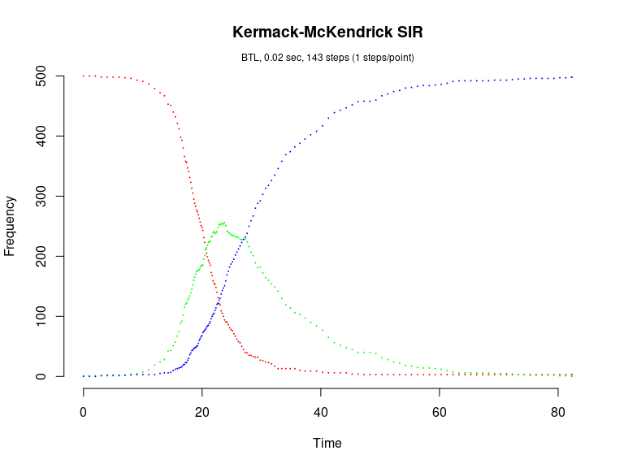

Kermack-McKendrick SIR model (Brown & Rothery, 1993)
================

<!-- github markdown built using 
rmarkdown::render("vignettes/sir.Rmd", output_format = "github_document")
-->

The Kermack-McKendrick SIR model is defined as

    dS/dt = -beta*N*S
    dI/dt = beta*N*S - gamma*I
    dR/dt = gamma*I

This model consists of two reactions with the following per capita
rates,

    transmission: beta
    recovery:     gamma

Load package

``` r
library(GillespieSSA)
```

Define parameters

``` r
parms <- c(beta=.001, gamma=.100)
tf <- 100                                      # Final time
simName <- "Kermack-McKendrick SIR"            # Name
```

Define initial state vector

``` r
x0 <- c(S=500, I=1, R=0)
```

Define state-change matrix

``` r
nu <- matrix(c(-1,0,1,-1,0,1),nrow=3,byrow=TRUE)
```

Define propensity functions

``` r
a  <- c("beta*S*I", "gamma*I")
```

Run simulations with the Direct method

``` r
set.seed(1)
out <- ssa(
  x0 = x0,
  a = a,
  nu = nu,
  parms = parms,
  tf = tf,
  method = "D",
  simName = simName,
  verbose = FALSE,
  consoleInterval = 1
) 
ssa.plot(out, show.title = TRUE, show.legend = FALSE)
```

<!-- -->

Run simulations with the Explict tau-leap method

``` r
set.seed(1)
out <- ssa(
  x0 = x0,
  a = a,
  nu = nu,
  parms = parms,
  tf = tf,
  method = "ETL",
  simName = simName,
  verbose = FALSE,
  consoleInterval = 1
) 
ssa.plot(out, show.title = TRUE, show.legend = FALSE)
```

<!-- -->

Run simulations with the Binomial tau-leap method

``` r
set.seed(2) # for some reason, this does not work with seed = 1
out <- ssa(
  x0 = x0,
  a = a,
  nu = nu,
  parms = parms,
  tf = tf,
  method = "BTL",
  simName = simName,
  verbose = FALSE,
  consoleInterval = 1
) 
ssa.plot(out, show.title = TRUE, show.legend = FALSE)
```

<!-- -->

Run simulations with the Optimized tau-leap method

``` r
set.seed(1)
out <- ssa(
  x0 = x0,
  a = a,
  nu = nu,
  parms = parms,
  tf = tf,
  method = "OTL",
  simName = simName,
  verbose = FALSE,
  consoleInterval = 1
) 
ssa.plot(out, show.title = TRUE, show.legend = FALSE)
```

<!-- -->
